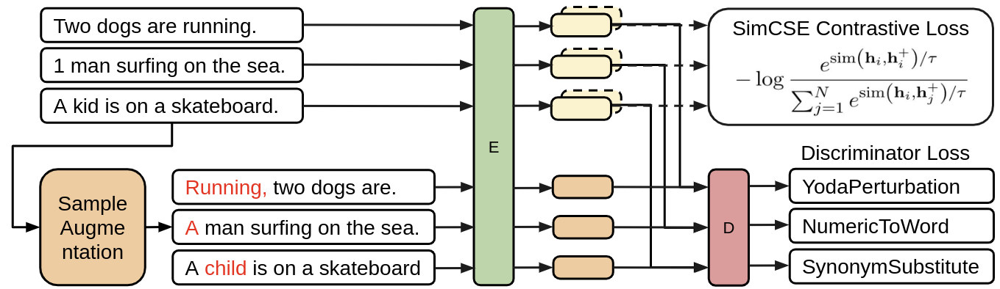

# AugCSE: Contrastive Sentence Embedding with Diverse Augmentation

This is the repo for paper `AugCSE: Contrastive Sentence Embedding with Diverse Augmentation` - AACL 2022.
We used a diverse set of natural language augmentation and a discriminator loss to improve general sentence embedding 
representation (in English). We show that simple rule-based augmentations can be just as effective at improving sentence
representations than language-model based augmentations, which can be expensive and biased.



In this repo, you will find 
- 100+ natural language augmentations (from NL-Augmenter)
- Training [script](./train.py) for AugCSE with different options(see [training arguments](https://github.com/PootieT/AugCSE/blob/39c7ee902c635b189528cf3f860e42e66a4a8078/train.py#L64)):
  - loss variations (triplet, ranking (SimCSE), contrastive, etc) [link](https://github.com/PootieT/AugCSE/blob/39c7ee902c635b189528cf3f860e42e66a4a8078/train.py#L126)
  - projection layer variations (linear, mixture of experts) [link](https://github.com/PootieT/AugCSE/blob/39c7ee902c635b189528cf3f860e42e66a4a8078/train.py#L104)
  - discriminator variations (binary, predict label, predict order) [link](https://github.com/PootieT/AugCSE/blob/39c7ee902c635b189528cf3f860e42e66a4a8078/train.py#L171)
  - positive, negative, or neutral augmentations [link](https://github.com/PootieT/AugCSE/blob/39c7ee902c635b189528cf3f860e42e66a4a8078/train.py#L265)
  - augmentation automatic labeling and sampling variations [link](https://github.com/PootieT/AugCSE/blob/39c7ee902c635b189528cf3f860e42e66a4a8078/train.py#L296)
  - supervised vs. unsupervised objective [link](https://github.com/PootieT/AugCSE/blob/39c7ee902c635b189528cf3f860e42e66a4a8078/train.py#L127)
  - single sentence vs. pair sentence classification [link](https://github.com/PootieT/AugCSE/blob/39c7ee902c635b189528cf3f860e42e66a4a8078/train.py#L216)
- Evaluation [script](./evaluate_sentence_embedding.py) for STS and SentEval (adapted from SimCSE)
- Various experimentation and analysis [scripts](./analysis)

If you have any questions, please contact `zilutang@bu.edu`, or submit issues / PRs.


## Environment

```commandline
conda create --name augmentation python=3.8
conda activate augmentation
pip install -r requirements.txt
```

## Data

Original as well as augmentation data for wiki1m can be downloaded. Read more [here](./data/README_2.md)
For augmented data, once downloaded, the folder of the zip file (unzipped) should be placed at the root of the project
for training script to work property:
```commandline
AugCSE/dump/{AUGMENTATION}/wiki1m_for_simcse_train_100.csv
```


## Train

### Train AugCSE 
To reproduce our results (for STS) with AugCSE framework, run the following training [script](./experiments/run_train_exp.py):
```commandline
./experiments/run_train_exp.py
```

The main arguments are explained as follows (for more detailed explanation, see actual [arguments](https://github.com/PootieT/AugCSE/blob/39c7ee902c635b189528cf3f860e42e66a4a8078/train.py#L64)):

| Arg                           | Type                                                                                                            | Descriptions                                                                                                                                                                                                                                                                                                                                                                                          |
|-------------------------------|-----------------------------------------------------------------------------------------------------------------|-------------------------------------------------------------------------------------------------------------------------------------------------------------------------------------------------------------------------------------------------------------------------------------------------------------------------------------------------------------------------------------------------------|
| model_name_or_paths           | string (e.g. `bert-base-uncased`)                                                                               | this allows you to switch to any backbone models supported in huggingface.                                                                                                                                                                                                                                                                                                                            |
| contrastive_loss_type         | string {`ranking`, `ranking_pos_neg`, `ranking_neg`, `triplet`, `alignment`, `contrastive`, `hard_contrastive`} | we follow the naming convention of the losses after [Sentence-BERT](https://www.sbert.net/docs/package_reference/losses.html) "ranking" loss is equivalent to SimCSE objective. In our model, it is combined with discriminative loss to achieve SOTA. "ranking_pos_neg" loss allows you to take in both positive augmentations and negative augmentations, as next example will show                 |
| diff_cse_mode                 | boolean                                                                                                         | this changes loss calculation such that augmentations aren't used during contrastive loss but during discriminative loss. Turn this off and you use augmentations in both losses.                                                                                                                                                                                                                     |
| positive_augmentations        | List [string] (comma separated)                                                                                 | In any of positive, negative, or neutral augmentations, you can specify a list of augmentation names with comma separated. These are class names (not directory name) of the augmentations in the  `transformations/`  directory. You may also build your own augmentations and invoke them here. In AugCSE setting, positive augmentations are used for discriminative loss and not contrastive loss |
| uniform_augmentation_sampling | boolean                                                                                                         | At every datapoint index, whether to select uniformly from one of the augmentations specified. It has to be false for using positives and negatives (in second example training script)                                                                                                                                                                                                               |
| remove_no_augmentations       | boolean                                                                                                         | Each augmentation has a perturbation rate. It may not be applicable for every sentence. Therefore, this argument dictates whether we throw away datapoints that are not augmented.                                                                                                                                                                                                                    |

### Train SimCSE with negatives 
In the second example [training script](./experiments/run_train_pos_neg_simcse.sh), you can train a model with positive 
augmentation as original sentence (SimCSE objective) and RandomDeletion as negative augmentation. Or, switch it with 
whatever augmentation you want! This is the script we used to obtain results in the motivational case studies experiments
```commandline
./experiments/run_train_pos_neg_simcse.py
```

The important arguments here are:

| Arg                     | Type                               | Descriptions                                                                                                                                                                                                                                                      |
|-------------------------|------------------------------------|-------------------------------------------------------------------------------------------------------------------------------------------------------------------------------------------------------------------------------------------------------------------|
| negative_augmentations  | List [string] (comma separated)    | List of augmentation to use as negatives (in addition to in-batch negatives). Since in contrastive loss, there has to be a positive paired with negatives, if a positive is not specified, then it defaults to the original sentence (with independent dropout).  |


### More Training Scenarios:
1. If you want to just try using different augmentations as positives, and only positives:
```commandline
--positive_augmentations "aug1,aug2,..."
--contrastive_loss_typo "ranking"  # or "triplet", "alignment", "contrastive", "hard_contrastive"
```

2. if you want to resample augmentations (since we pick an augmentation method at each index, and all augmented datasets
are cached):
```commandline
--resample_augmentation_per_epoch true
```

3. if you are not sure whether the augmentation should be positive or negative? We added `neutral_augmentations` just
for this reason:
```commandline
--neutral_augmentations "aug1,aug2,..."
--augmentation_label_method "lm_uniform"
--augmentation_label_ppl_scalar 1.0
--augmentation_label_sim_scalar 0.2
```

Now here are a couple of new args that we should explain:

| Arg                            | Type                                             | Descriptions                                                                                                                                                                                                                                                                                            |
|--------------------------------|--------------------------------------------------|---------------------------------------------------------------------------------------------------------------------------------------------------------------------------------------------------------------------------------------------------------------------------------------------------------|
| neutral_augmentations          | List [string] (comma separated)                  | List of augmentation to use. Whether it is used as positive or negative is determined through augmentation_label_method                                                                                                                                                                                 |
| augmentation_label_method      | string {`pessimistic`,`optimistic`,`lm_uniform`} | `Pessimistic` treats all augmentations as negative augmentations, `Optimistic` treats all augmentation as positive augmentations, `lm_uniform` uses perplexity difference or similarity between augmented sentence / original sentence as labels for positivity. (ppl and sim needs to be pre-computed) |
| augmentation_label_ppl_scalar  | float                                            | Scaling factor multiplied to perplexity standard deviation to determine negative augmentations. The larger this value the more positive labels                                                                                                                                                          |
| augmentation_label_sim_scalar  | float                                            | Scaling factor multiplied to similarity standard deviation to determine negative augmentations. The larger this value the more negative labels                                                                                                                                                          |

Now we should warn you, this may seem like a cool idea, it has not worked well for us. However, this dynamic 
augmentation labeling problem should theoretically be able to solve the issue in NLP augmentation, where the semantic 
changes brought by augmentation to each sentence is not uniform. Through some metric in the future, we hope to be able 
to quantify that, and find the exact heuristics that can automatically label.

4. You want to use a new augmentation that is not already cached and downloadable through the drive folder. How does the
cache gets created in the first place? How do you specify augmentation specific arguments?

Our code works like this. If the augmentation cache is not found, the augmentation method is run over the whole input 
dataset with N datapoints. Once all augmentations are created (N X A, where A is number of augmentations you want to use)
We go through each datapoints 1:N, and at each index, we pick an augmentation, and combine all samples into another 
cached dataset. This is where `resample_augmentation_per_epoch` or `regenerate_augmentation_per_epoch` comes into play.
But ideally, you generate augmentations once, and you are done (because some, especially langauge model based 
augmentations) are very expensive to run. Now, here are a couple of args related to augmentation generations:

| Arg                         | Type               | Descriptions                                                                                                                                                                                                                                                                                                                                                                                      |
|-----------------------------|--------------------|---------------------------------------------------------------------------------------------------------------------------------------------------------------------------------------------------------------------------------------------------------------------------------------------------------------------------------------------------------------------------------------------------|
| augmentation_batch_size     | integer            | If an augmentation supports batched transformation (important for GPU based ones), you may specify it here. An example of batched transformation is [`DiverseParaphrase`](https://github.com/PootieT/AugCSE/blob/c77465f9df4939cb668f30e0310b3b56ba23f4bc/transformations/diverse_paraphrase/transformation.py#L204)                                                                              |
| augmentation_init_args      | Dict [string, Any] | An augmentation may have parameters to themselves (e.g. random drop rate), in these cases you can pass in a JSON encoded kwargs as input argument to initialize those augmentations. Example transformation is [`RandomWordAugmentation`](https://github.com/PootieT/AugCSE/blob/c77465f9df4939cb668f30e0310b3b56ba23f4bc/transformations/random_word_augmentation/transformation.py#L19)         |


### Custom Augmentations

For full list of augmentations, you can browse the `/transformations` directory, checkout the [NLAugmentor Paper Appendix 
Section B](https://arxiv.org/pdf/2112.02721.pdf), or go to their most updated [repo](https://github.com/GEM-benchmark/NL-Augmenter) and see if there are new interesting 
augmentations updated. If you still can't find anything, just find a directory within `/transformations` and copy the 
structure. We created several (e.g. `RandomWordAugmentation`) for our experiments.

the directory would look like
```
/transformations
|- /myAugmentation
|----__init__.py
|----README.md
|----requirements.txt
|----transformation.py
|----test.json
```
Most of the files are related to NLAugmentor robustness test. the most important file is 
the `transformation.py` file.

```python
from typing import List

from interfaces.SentenceOperation import SentenceOperation
from tasks.TaskTypes import TaskType

class myInvertAugmentation(SentenceOperation):
    tasks = [TaskType.TEXT_CLASSIFICATION, TaskType.TEXT_TO_TEXT_GENERATION]
    
    # class variables like this can be for filtering / search
    languages = ["en"]  
    keywords = []

    def __init__(self, add_tag: bool=False, seed=0):
        """
        init methods can contain arguments which can be initialized in
        training scripts through `augmentation_init_args`
        """
        super().__init__(seed)
        self.add_tag = add_tag

    def generate(self, sentence: str) -> List[str]:
        """
        during generation, each example is called upon with this method
        each sentence is expected to return a list of augmentations (could 
        be more than 1). In our training framework, we randomly select one
        if more than 1 examples is returned
        """
        augmented_text = " ".join(sentence.split()[::-1])
        if self.add_tag:
          augmented_text += " very nice."
        return [augmented_text]
    
    def generate_batch(self, sentences: List[str]) -> List[List[str]]:
        """
        batched generation is very useful for GPU intense augmentations
        """
        augmented_sentences = [self.generate(s) for s in sentences]
        return augmented_sentences
```

And just like that, your augmentation can be used in your training script (of course after it is being cached).
For example, you can train it as a positive augmentation using SimCSE objective:
```commandline
--positive_augmentations "myInvertAugmentation"
--contrastive_loss_typo "ranking" 
```


## Evaluate
For example evaluation on STS or SentEval, first download SentEval dataset
```commandline
cd SentEval/data/downstream && ./download_dataset.sh
```

Then, run evaluation script: 
```commandline
./run_eval.sh
```

## Hyperparameters:

For best hyperparameters, please refer to paper Appendix A.7 for detail.


## Future Studies:

This paper only shows the beginning of usefulness of rule based augmentations (especially in low-resource settings). A 
robust domain-agnostic sentence embedding can be useful for many downstream task, from natural language understanding to
text generation. Specific rule based augmentations can also be extremely valuable in instilling invanriances within the 
model, which becomes especially valuable in AI fairness (discriminative loss vs. instance contrastive loss also relates
nicely to improving group and individual fairness). If you want to collaborate on any of the above areas, feel free to 
shoot us an email! We are excited to hear how our repo can be made useful for your experimentation!


To cite our paper, please use:
```
@article{Tang2022AugCSE,
  title={AugCSE: Contrastive Sentence Embedding with Diverse Augmentation},
  author={Tang, Zilu and Kocyigit, Muhammed Yusuf and Wijaya, Derry},
  journal={link coming},
  year={2022}
}

```

The repo is adapted from [NL-Augmenter](https://github.com/GEM-benchmark/NL-Augmenter) and [SimCSE](https://github.com/princeton-nlp/SimCSE)
